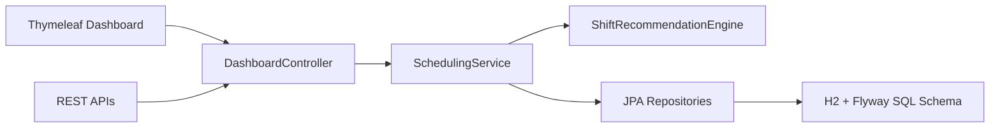

# ShiftPilot

ShiftPilot is a Java + SQL workforce scheduling application built to look more like an operations tool than a class demo. It combines a Spring Boot backend, Flyway-managed SQL schema, and a rule-based staffing engine that recommends the best candidate for a shift while enforcing availability, overlap, rest-window, and weekly-capacity constraints.

## Why this project stands out

- It solves a real scheduling problem instead of just doing CRUD.
- It exposes both a server-rendered dashboard and JSON APIs.
- It uses SQL migrations, seeded demo data, and a domain model with business rules.
- It includes unit and integration tests for the recommendation engine and service layer.
- It surfaces staffing risk and team utilization analytics on the dashboard.

## Core features

- Skill-based shift matching
- 12-hour minimum rest policy enforcement
- Overlap detection between assignments
- Weekly capacity limits per employee
- Ranked candidate recommendations with transparent rule explanations
- Coverage watchlist for understaffed or risky shifts
- Team utilization analytics
- Flyway database migrations with seeded sample data
- H2 console for inspecting the SQL data model

## Tech stack

- Java 21
- Spring Boot 3
- Spring MVC + Thymeleaf
- Spring Data JPA
- H2 SQL database
- Flyway
- JUnit 5 + Spring Boot Test

## Architecture



### Main backend responsibilities

- `SchedulingService`
  Handles dashboard composition, assignments, analytics, and API-facing data assembly.
- `ShiftRecommendationEngine`
  Applies the business rules and computes ranked candidates.
- `db/migration`
  Defines the SQL schema and demo dataset in versioned Flyway migrations.

## Rule engine logic

Each recommendation is scored only after the employee passes all gate checks:

1. Required skill must exist.
2. Employee must be available for the full shift window.
3. Employee must not already have an overlapping assignment.
4. Employee must respect the 12-hour rest window.
5. Employee must stay within max weekly hours.

Eligible candidates are then ranked using:

- skill level
- preferred shift-type match
- remaining weekly capacity

## Data model

Main entities:

- `employees`
- `skills`
- `employee_skills`
- `availability_windows`
- `shifts`
- `shift_assignments`

This structure allows the app to model:

- many-to-many employee skill mapping
- daily availability windows
- per-shift headcount requirements
- assignment history for rest and overlap checks

## Project structure

```text
src/main/java/com/atheboy/shiftpilot
  domain/        JPA entities and enums
  repository/    Spring Data repositories
  service/       recommendation engine and dashboard orchestration
  web/           MVC controllers and REST API controllers

src/main/resources
  db/migration/  Flyway SQL schema + seed data
  templates/     Thymeleaf dashboard
  static/        CSS
```

## How to run

### Requirements

- Java 21 installed

### Start the app

On Windows PowerShell:

```powershell
.\mvnw.cmd spring-boot:run
```

On macOS or Linux:

```bash
./mvnw spring-boot:run
```

Then open:

- [http://localhost:8080](http://localhost:8080)

Optional tools:

- H2 console: [http://localhost:8080/h2-console](http://localhost:8080/h2-console)
- Dashboard API: [http://localhost:8080/api/dashboard](http://localhost:8080/api/dashboard)
- Recommendation API example: [http://localhost:8080/api/shifts/1/recommendations](http://localhost:8080/api/shifts/1/recommendations)

H2 console connection values:

- JDBC URL: `jdbc:h2:mem:shiftpilot`
- Username: `sa`
- Password: leave blank

## Run tests

On Windows PowerShell:

```powershell
.\mvnw.cmd test
```

On macOS or Linux:

```bash
./mvnw test
```

## Demo scenario

The seeded dataset includes:

- six employees across multiple teams
- three skill domains
- availability windows
- six operational shifts with mixed priority
- existing assignments that create realistic staffing gaps

That gives you a working dashboard immediately after startup with:

- open shifts
- top candidate suggestions
- staffing risk cards
- utilization by team

## Portfolio framing

ShiftPilot is intentionally designed to show more than UI polish. It demonstrates:

- domain modeling
- SQL schema design
- backend business-rule implementation
- testable service boundaries
- API + server-rendered delivery
- operational tradeoff thinking

## Verification note

The codebase includes tests and Maven wrapper commands, but during development in this workspace the Maven dependency download hit a machine-level disk-space problem before the full test run could complete. The app and repo are set up correctly for standard Maven execution once local disk space is available.
